# Blocking vs Non-Blocking Operations - Code Examples

## 📚 Table of Contents
1. [What is Blocking?](#what-is-blocking)
2. [What is Non-Blocking?](#what-is-non-blocking)
3. [Examples from Our Code](#examples-from-our-code)
4. [Why It Matters](#why-it-matters)
5. [Visual Comparison](#visual-comparison)

---

## 🔒 What is Blocking?

**Blocking** means the program **waits** (stops execution) until an operation completes.

### Characteristics:
- Execution **pauses** at that line
- Program **cannot continue** until operation finishes
- If operation never completes, program **hangs forever**
- **Blocks the goroutine/thread**

### Real-World Analogy:
Like waiting in line at a store - you **cannot leave** until it's your turn.

---

## ⚡ What is Non-Blocking?

**Non-Blocking** means the program **doesn't wait** - it either succeeds immediately or fails/times out.

### Characteristics:
- Execution **continues immediately**
- Returns **immediately** with success or failure
- Never **hangs** - always returns control
- Uses **timeouts** or **default cases**

### Real-World Analogy:
Like checking if a store is open - you **check and leave immediately**, don't wait.

---

## 💻 Examples from Our Code

### Example 1: BLOCKING - `Listener.Accept()`

**Location**: `server.go:57`

```go
for {
    client, err := s.Listener.Accept()  // ⚠️ BLOCKING
    if err != nil {
        log.Fatalf("accept error: %v", err)
    }
    // ... rest of code
}
```

**Why It's Blocking:**
- `Accept()` **waits** until a new connection arrives
- If no connections come, it **blocks forever**
- The loop **cannot continue** until a connection is accepted
- This is **intentional** - we want to wait for connections

**What Happens:**
```
Time →
Server: Accept() called
Server: ⏸️ WAITING... (blocked)
Server: ⏸️ WAITING... (still blocked)
Client: Connects!
Server: ✅ Connection accepted, continues
```

**If We Made It Non-Blocking:**
```go
// This would NOT work well:
select {
case client := <-acceptChan:  // Would need non-blocking accept
    // Handle connection
default:
    // No connection - but we'd miss connections!
}
```

---

### Example 2: BLOCKING - Channel Receive (`range`)

**Location**: `worker.go:73`

```go
for job := range w.JobChan {  // ⚠️ BLOCKING
    log.Printf("Worker %d, processing request %d", workerId, job.Id)
    processRequests(job)
}
```

**Why It's Blocking:**
- `range` over channel **waits** until a job is available
- If channel is empty, worker **blocks** waiting
- Worker **cannot continue** until job arrives
- This is **intentional** - workers should wait for work

**What Happens:**
```
Time →
Worker: range w.JobChan
Worker: ⏸️ WAITING... (no jobs)
Worker: ⏸️ WAITING... (still no jobs)
Server: Job submitted!
Worker: ✅ Job received, processes it
Worker: range w.JobChan (waits for next job)
```

**Visual Flow:**
```
Worker Goroutine:
┌─────────────────────────────┐
│ for job := range JobChan   │ ← BLOCKS HERE
│   processRequests(job)      │   (waits for job)
└─────────────────────────────┘
         ⬇️ (blocks until job arrives)
```

---

### Example 3: NON-BLOCKING - Channel Send with `select` + `default`

**Location**: `server.go:87-97`

```go
select {
case s.JobChan <- job:  // ✅ NON-BLOCKING
    // Job accepted - increment metrics
    s.Metrics.Requests.WithLabelValues("processed").Inc()
default:  // ✅ Executes immediately if channel full
    // Worker pool is full - reject request
    response := []byte("HTTP/1.1 503 Service Unavailable...")
    client.Write(response)
    client.Close()
    log.Printf("Request %d rejected - server busy (queue full)", connID)
}
```

**Why It's Non-Blocking:**
- `select` with `default` **never waits**
- If channel is full, goes to `default` **immediately**
- Execution **continues** right away
- **Critical** - prevents blocking the accept loop

**What Happens:**

**Scenario 1: Channel Has Space**
```
Time →
Server: select { case JobChan <- job }
Server: ✅ Job sent immediately
Server: Continues to next iteration
```

**Scenario 2: Channel is Full**
```
Time →
Server: select { case JobChan <- job }
Server: ❌ Channel full!
Server: ✅ Goes to default immediately (no wait)
Server: Sends 503 response
Server: Continues to next iteration
```

**If We Made It Blocking (BAD):**
```go
// ❌ BAD - This would block!
s.JobChan <- job  // Blocks if channel full
// Server would hang here, can't accept new connections!
```

---

### Example 4: BLOCKING - `Conn.Read()`

**Location**: `worker.go:45`

```go
request := make([]byte, 4096)
_, err := j.Conn.Read(request)  // ⚠️ BLOCKING (but with timeout)
if err != nil {
    // Handle error
}
```

**Why It's Blocking (with Protection):**
- `Read()` **waits** for data from client
- But we set a **deadline** (timeout) to prevent infinite blocking
- If no data arrives in 3 seconds, it **times out** and returns error

**What Happens:**
```
Time →
Worker: Conn.Read() called
Worker: ⏸️ WAITING for data...
Client: Sends data after 1 second
Worker: ✅ Data received, continues

OR

Worker: Conn.Read() called
Worker: ⏸️ WAITING for data...
Worker: ⏸️ WAITING... (2 seconds passed)
Worker: ⏸️ WAITING... (3 seconds - TIMEOUT!)
Worker: ✅ Returns error (timeout), doesn't hang forever
```

**The Timeout Protection:**
```go
// Set read deadline to prevent hanging (3 seconds)
j.Conn.SetReadDeadline(time.Now().Add(3 * time.Second))
request := make([]byte, 4096)
_, err := j.Conn.Read(request)  // Blocks max 3 seconds
```

**Without Timeout (DANGEROUS):**
```go
// ❌ BAD - Could block forever!
_, err := j.Conn.Read(request)  // Waits forever if client doesn't send
```

---

### Example 5: BLOCKING - `Conn.Write()`

**Location**: `worker.go:61`

```go
response := []byte("HTTP/1.1 200 OK...")
bytesWritten, writeErr := j.Conn.Write(response)  // ⚠️ BLOCKING (with timeout)
```

**Why It's Blocking (with Protection):**
- `Write()` **waits** until data is sent
- But we set a **deadline** (2 seconds)
- If write takes too long, it **times out**

**What Happens:**
```
Time →
Worker: Conn.Write(response) called
Worker: ⏸️ Sending data...
Worker: ✅ Data sent (0.1 seconds)
Worker: Continues

OR (if network is slow)

Worker: Conn.Write(response) called
Worker: ⏸️ Sending data...
Worker: ⏸️ Still sending... (1.5 seconds)
Worker: ⏸️ Still sending... (2 seconds - TIMEOUT!)
Worker: ✅ Returns error, doesn't hang
```

---

## 🎯 Why It Matters in Our Code

### Critical Non-Blocking: Job Submission

**Why We MUST Use Non-Blocking:**

```go
// ✅ GOOD - Non-blocking
select {
case s.JobChan <- job:
    // Success
default:
    // Reject immediately
}

// ❌ BAD - Blocking
s.JobChan <- job  // Would block if channel full!
```

**Problem with Blocking Version:**
```
Server accepts connection 1
Server tries to submit job 1 → Channel full → ⏸️ BLOCKS
Server CANNOT accept connection 2 (blocked!)
Server CANNOT accept connection 3 (still blocked!)
All new connections are REJECTED by OS!
```

**Solution with Non-Blocking:**
```
Server accepts connection 1
Server tries to submit job 1 → Channel full → ✅ Rejects immediately
Server accepts connection 2 → Channel full → ✅ Rejects immediately
Server accepts connection 3 → Channel has space → ✅ Accepts
Server continues accepting connections!
```

---

## 📊 Visual Comparison

### Blocking Operation Flow

```mermaid
sequenceDiagram
    participant Code
    participant Operation
    
    Code->>Operation: Call blocking operation
    Operation->>Operation: ⏸️ WAITING...
    Operation->>Operation: ⏸️ Still waiting...
    Operation->>Code: ✅ Result (after wait)
    Code->>Code: Continue execution
```



### Non-Blocking Operation Flow

```mermaid
sequenceDiagram
    participant Code
    participant Operation
    
    Code->>Operation: Call non-blocking operation
    Operation->>Code: ✅ Result immediately (success/fail)
    Code->>Code: Continue execution (no wait)
```



---

## 🔍 Complete Example: Our Server Flow

### Blocking Operations (Intentional)

1. **`Listener.Accept()`** - Waits for connections
   ```go
   client, err := s.Listener.Accept()  // Blocks until connection
   ```

2. **`range w.JobChan`** - Workers wait for jobs
   ```go
   for job := range w.JobChan {  // Blocks until job available
       processRequests(job)
   }
   ```

3. **`Conn.Read()`** - Waits for request data (with timeout)
   ```go
   j.Conn.Read(request)  // Blocks max 3 seconds
   ```

### Non-Blocking Operations (Critical)

1. **Job Submission** - Never blocks accept loop
   ```go
   select {
   case s.JobChan <- job:  // Non-blocking send
       // Success
   default:
       // Reject immediately
   }
   ```

---

## 🎓 Key Takeaways

### When to Use Blocking:
- ✅ **Accepting connections** - We want to wait
- ✅ **Workers waiting for jobs** - They should wait
- ✅ **Reading data** - But with **timeouts**!

### When to Use Non-Blocking:
- ✅ **Submitting jobs** - Never block the accept loop
- ✅ **Critical paths** - Where blocking would cause problems
- ✅ **Graceful degradation** - Reject instead of hanging

### Protection Mechanisms:
1. **Timeouts** - `SetReadDeadline()`, `SetWriteDeadline()`
2. **Select with default** - Non-blocking channel operations
3. **Context cancellation** - (not used here, but common pattern)

---

## 🚨 Common Mistakes

### Mistake 1: Blocking in Accept Loop

```go
// ❌ BAD
for {
    client, _ := s.Listener.Accept()
    s.JobChan <- Job{Conn: client}  // BLOCKS if channel full!
    // Can't accept new connections while blocked!
}

// ✅ GOOD
for {
    client, _ := s.Listener.Accept()
    select {
    case s.JobChan <- Job{Conn: client}:  // Non-blocking
        // Success
    default:
        // Reject immediately, continue accepting
    }
}
```

### Mistake 2: No Timeouts on Network Operations

```go
// ❌ BAD - Could hang forever
_, err := conn.Read(data)

// ✅ GOOD - Times out after 3 seconds
conn.SetReadDeadline(time.Now().Add(3 * time.Second))
_, err := conn.Read(data)
```

---

## 📝 Summary Table

| Operation | Type | Location | Why |
|-----------|------|----------|-----|
| `Accept()` | Blocking | `server.go:57` | Wait for connections |
| `range JobChan` | Blocking | `worker.go:73` | Workers wait for jobs |
| `select + default` | Non-blocking | `server.go:87` | Never block accept loop |
| `Conn.Read()` | Blocking (with timeout) | `worker.go:45` | Wait for data, but timeout |
| `Conn.Write()` | Blocking (with timeout) | `worker.go:61` | Send data, but timeout |

---

## 🎯 Real-World Impact

### With Non-Blocking Job Submission (Our Code):
- ✅ Server **always** accepts new connections
- ✅ Rejects when busy (503 response)
- ✅ **Never hangs** - always responsive
- ✅ Can handle **thousands** of rapid connections

### If We Used Blocking Job Submission:
- ❌ Server **hangs** when channel full
- ❌ **Cannot accept** new connections
- ❌ OS **rejects** connections (connection refused)
- ❌ Server becomes **unresponsive**

---

**The key insight**: We use **blocking** where we **want to wait** (accepting, reading), and **non-blocking** where waiting would be **catastrophic** (job submission in accept loop).

