# TCPie - Comprehensive Project Explanation

## 📋 Table of Contents
1. [Project Overview](#project-overview)
2. [Architecture](#architecture)
3. [Worker Pool Pattern](#worker-pool-pattern)
4. [Rate Limiting](#rate-limiting)
5. [Flow Diagrams](#flow-diagrams)
6. [Code Walkthrough](#code-walkthrough)
7. [Naming Conventions](#naming-conventions)

---

## 🎯 Project Overview

**TCPie** is a high-performance, concurrent TCP server written in Go that implements:
- **Worker Pool Pattern** for concurrent request processing
- **Token Bucket Rate Limiting** to prevent server overload
- **Non-blocking Job Submission** using Go channels
- **Prometheus Metrics** for monitoring
- **Graceful Shutdown** handling

### What It Does
The server accepts TCP connections, processes HTTP-like requests concurrently using a worker pool, applies rate limiting, and responds with HTTP responses. It's designed to handle high loads efficiently without blocking.

---

## 🏗️ Architecture

### High-Level Architecture Diagram

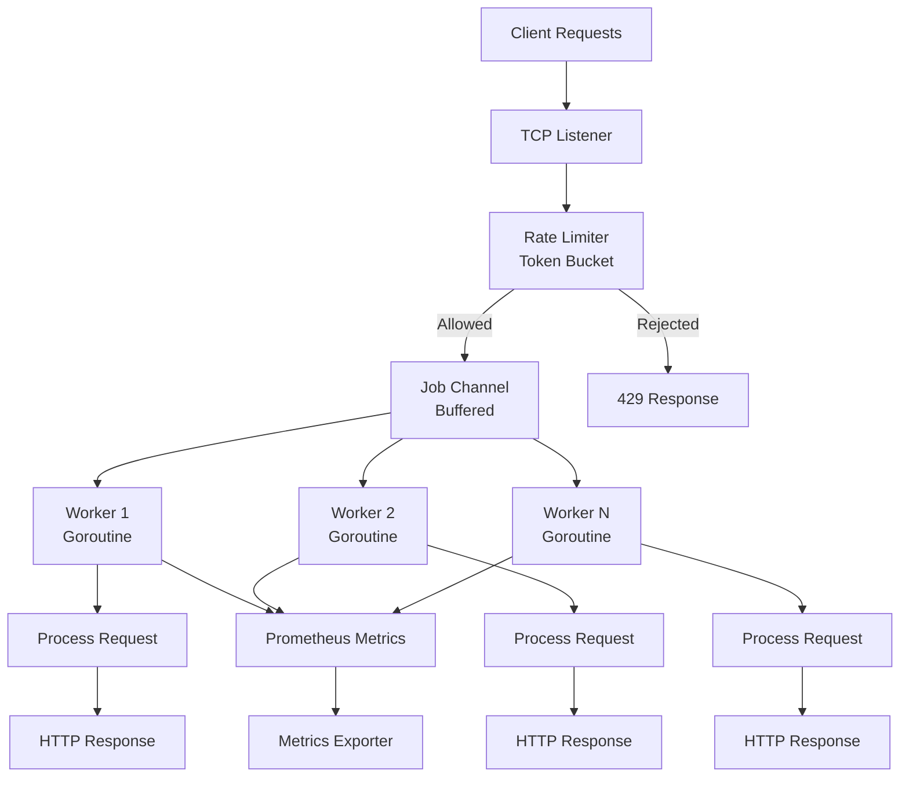

### Component Breakdown

```
┌─────────────────────────────────────────────────────────┐
│                      Server                              │
├─────────────────────────────────────────────────────────┤
│  ┌──────────────┐  ┌──────────────┐  ┌──────────────┐ │
│  │   Listener   │  │ Rate Limiter  │  │ Worker Pool  │ │
│  │  (TCP Socket)│  │ (Token Bucket)│  │  (Channels)  │ │
│  └──────┬───────┘  └──────┬────────┘  └──────┬───────┘ │
│         │                 │                   │         │
│         └─────────────────┼───────────────────┘         │
│                           │                             │
│                    ┌──────▼──────┐                      │
│                    │ Job Channel │                      │
│                    │  (Buffered) │                      │
│                    └──────┬──────┘                      │
│                           │                             │
│         ┌──────────────────┼──────────────────┐        │
│         │                  │                  │        │
│    ┌────▼────┐       ┌────▼────┐       ┌────▼────┐   │
│    │ Worker1 │       │ Worker2 │       │ WorkerN │   │
│    │(Goroutine)│      │(Goroutine)│      │(Goroutine)│   │
│    └─────────┘       └─────────┘       └─────────┘   │
└─────────────────────────────────────────────────────────┘
```

---

## 🔄 Worker Pool Pattern

### Pattern Overview

The **Worker Pool Pattern** is a concurrency design pattern where:
- A fixed number of workers (goroutines) process jobs concurrently
- Jobs are submitted to a shared channel (job queue)
- Workers consume jobs from the channel
- Prevents resource exhaustion by limiting concurrent processing

### Worker Pool Pattern Diagram

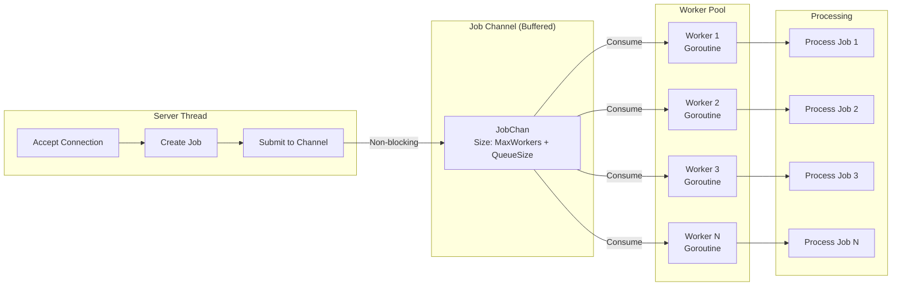

### Channel Capacity Explanation

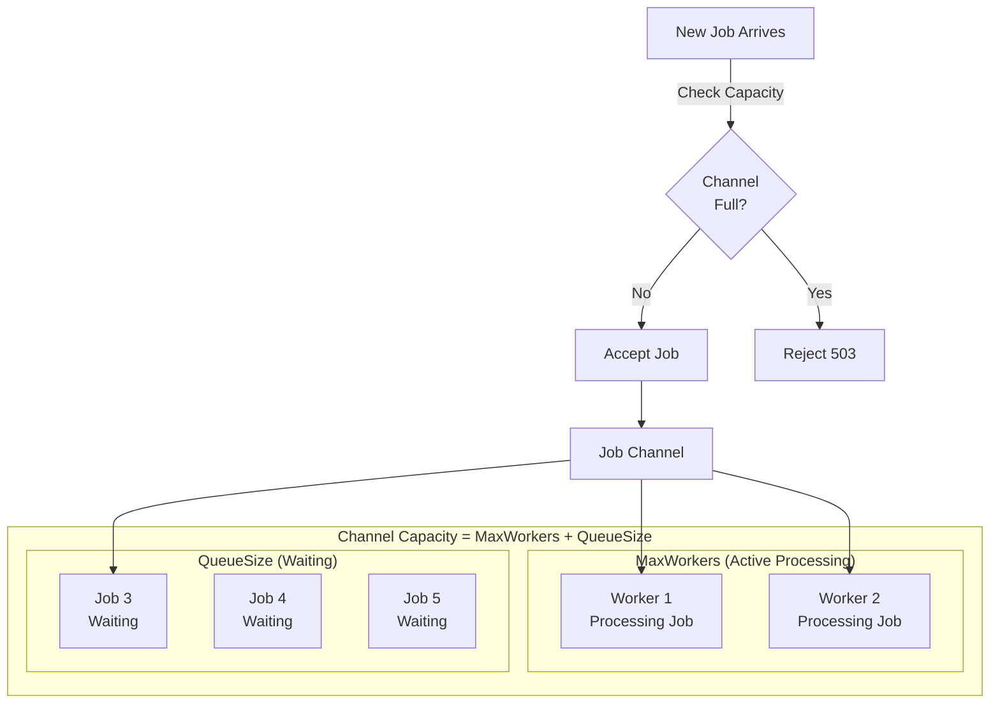

**Why MaxWorkers + QueueSize?**
- When workers are processing, they've **removed** jobs from the channel
- Channel buffer holds **waiting** jobs
- Total capacity = jobs being processed + jobs waiting = `MaxWorkers + QueueSize`

---

## 🚦 Rate Limiting

### Token Bucket Algorithm

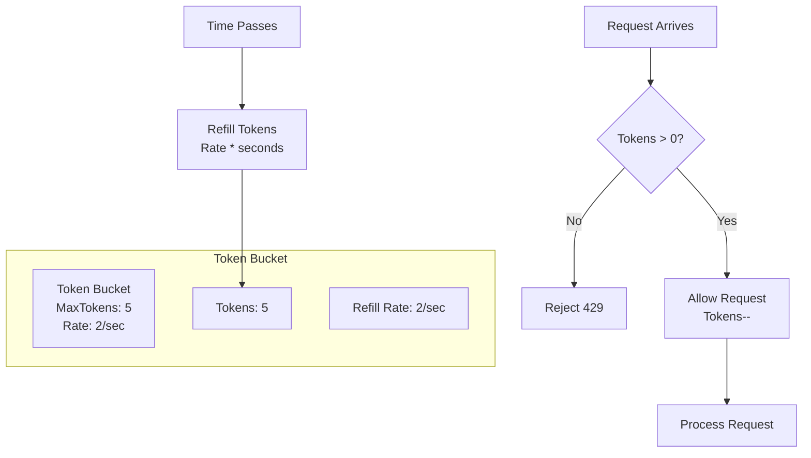

### Rate Limiter Flow

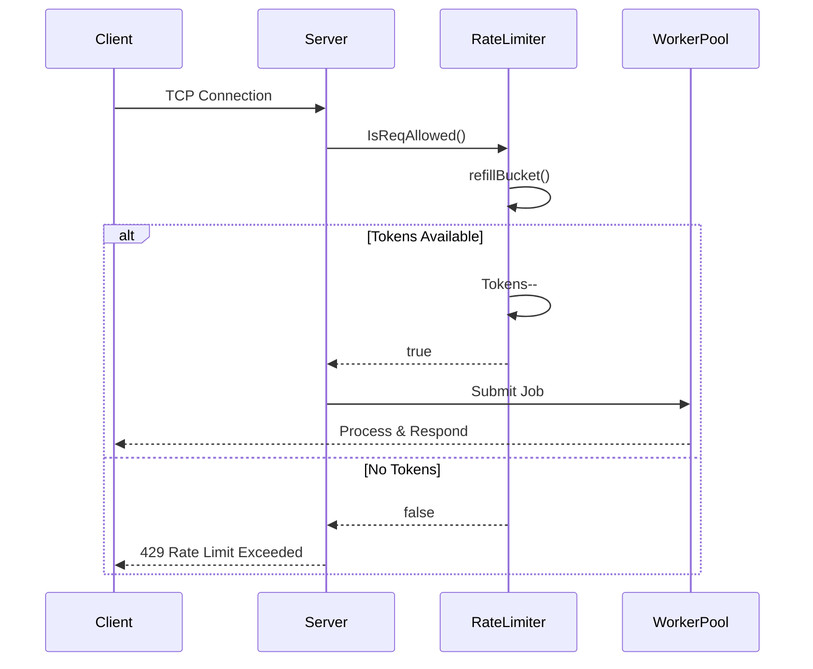

---

## 📊 Flow Diagrams

### Complete Request Flow

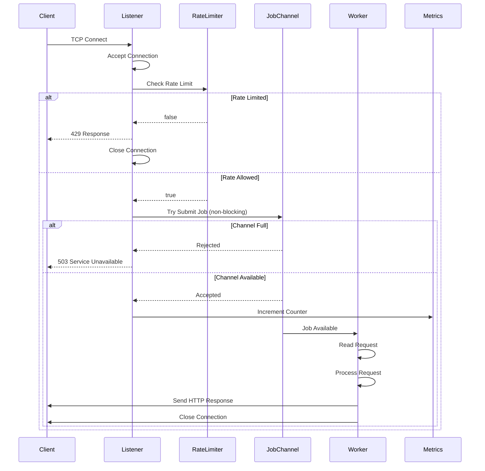

### Worker Lifecycle

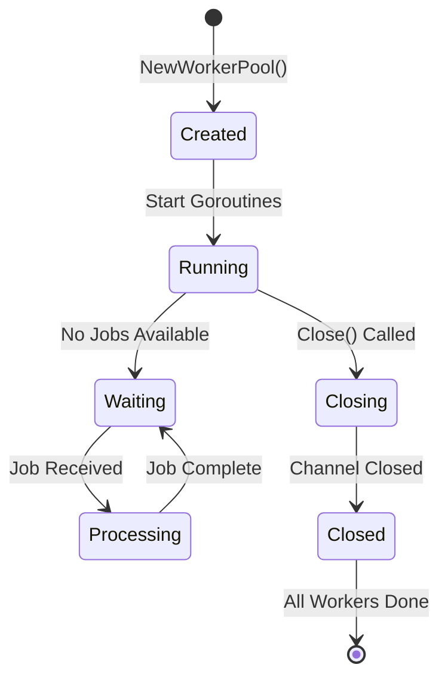

### Channel State Machine

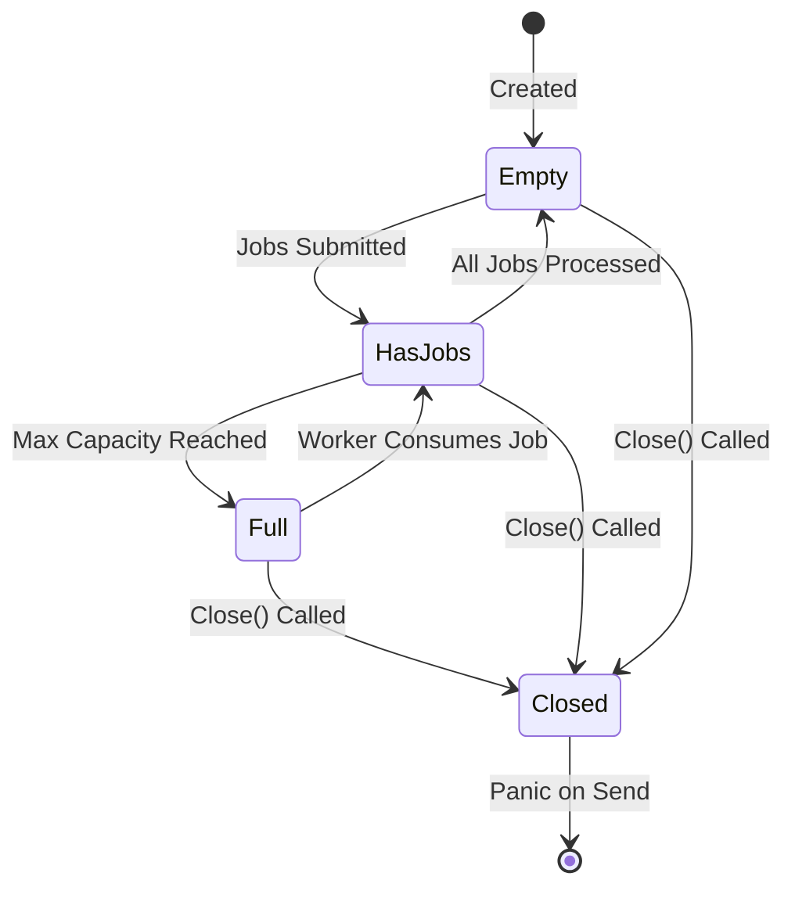

---

## 🔍 Code Walkthrough

### server.go - Detailed Explanation

#### 1. Server Struct

```go
type Server struct {
    WorkerPool        // Embedded WorkerPool (inherits JobChan, MaxWorkers, etc.)
    Port       int    // TCP port to listen on
    URL        string // Server URL/hostname
    Opts       ServerOpts // Configuration options
    Metrics    metrics.ServerMetrics // Prometheus metrics
    Listener   net.Listener // TCP listener socket
    reqLimiter ratelimiter.TokenBucket // Rate limiter instance
}
```

**Design Decision**: `WorkerPool` is embedded, so `Server` can directly access `JobChan` and other WorkerPool fields.

#### 2. createListener() Function

```go
func createListener(url string, port int) (net.Listener, error)
```

**Purpose**: Creates a TCP listener socket
**Why Standalone**: Pure function, no side effects, easily testable
**Returns**: `net.Listener` and error

**Flow**:
1. Format address: `"hostname:port"`
2. Call `net.Listen("tcp", addr)`
3. Return listener or error

#### 3. handleRequests() Function

```go
func handleRequests(s *Server)
```

**Purpose**: Main request handling loop (blocks forever)

**Step-by-Step Flow**:

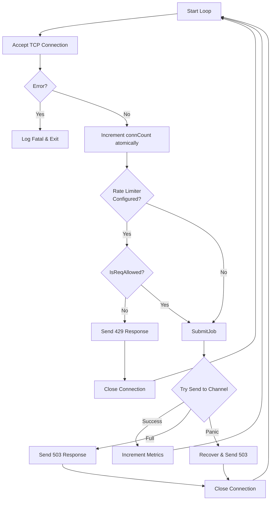

**Key Features**:
- **Atomic Counter**: `atomic.AddInt64(&connCount, 1)` - thread-safe connection ID
- **Non-blocking Submit**: `select` with `default` prevents blocking
- **Panic Recovery**: Handles closed channel gracefully

#### 4. NewServer() Function

```go
func NewServer(url string, port int, opts ServerOpts, metrics metrics.ServerMetrics) (*Server, error)
```

**Purpose**: Constructor function - initializes all components

**Initialization Order**:
1. Create TCP listener
2. Create worker pool (spawns goroutines)
3. Create rate limiter
4. Assemble Server struct

**Why This Order**: Listener first (can fail), then workers (need channel), then rate limiter (independent).

#### 5. Start() Method

```go
func (s *Server) Start()
```

**Purpose**: Starts the server (blocks forever)
**Calls**: `handleRequests(s)` which runs infinite loop

#### 6. Close() Method

```go
func (s *Server) Close()
```

**Purpose**: Graceful shutdown
**Actions**:
1. Close listener (stops accepting new connections)
2. Close worker pool (closes channel, waits for workers)

---

### worker.go - Detailed Explanation

#### 1. Job Struct

```go
type Job struct {
    Id   int       // Unique job identifier
    Conn net.Conn  // TCP connection to process
}
```

**Purpose**: Represents a unit of work
**Why This Design**: Minimal - only what's needed to process a request

#### 2. WorkerPool Struct

```go
type WorkerPool struct {
    MaxWorkers int      // Maximum concurrent workers
    QueueSize  int      // Jobs that can wait in queue
    JobChan    chan Job // Buffered channel for jobs
    wg         *sync.WaitGroup // WaitGroup for graceful shutdown
}
```

**Channel Size**: `MaxWorkers + QueueSize`
- **MaxWorkers**: Jobs currently being processed (removed from channel)
- **QueueSize**: Jobs waiting in channel buffer
- **Total**: Maximum jobs in system

#### 3. NewWorkerPool() Function

```go
func NewWorkerPool(maxWorkers, queueSize int) *WorkerPool
```

**Purpose**: Creates and initializes worker pool

**What It Does**:
1. Creates WorkerPool struct
2. Creates buffered channel: `make(chan Job, maxWorkers+queueSize)`
3. Creates WaitGroup for synchronization
4. Spawns `maxWorkers` goroutines
5. Each goroutine runs `worker()` function

**Goroutine Creation**:
```go
for i := 0; i < w.MaxWorkers; i++ {
    w.wg.Add(1)           // Increment WaitGroup counter
    go w.worker(i)        // Start worker goroutine
}
```

#### 4. worker() Method

```go
func (w *WorkerPool) worker(workerId int)
```

**Purpose**: Worker goroutine that processes jobs

**Lifecycle**:

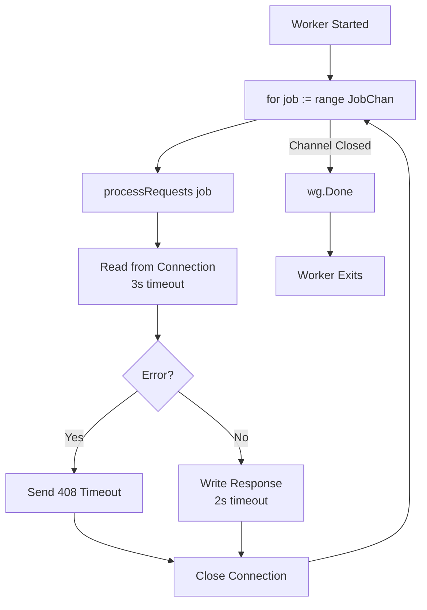

**Key Features**:
- **Range Loop**: `for job := range w.JobChan` - automatically exits when channel closes
- **Timeouts**: Prevents hanging connections
- **Error Handling**: Sends proper HTTP error responses

#### 5. processRequests() Function (Inside worker)

```go
processRequests := func(j Job) {
    // Set read deadline (3 seconds)
    j.Conn.SetReadDeadline(time.Now().Add(3 * time.Second))
    
    // Read request
    request := make([]byte, 4096)
    _, err := j.Conn.Read(request)
    
    if err != nil {
        // Send 408 timeout response
        return
    }
    
    // Set write deadline (2 seconds)
    j.Conn.SetWriteDeadline(time.Now().Add(2 * time.Second))
    
    // Send HTTP response
    response := []byte("HTTP/1.1 200 OK\r\nConnection: close\r\nContent-Length: 13\r\n\r\nHello world !")
    j.Conn.Write(response)
    
    // Close connection
    j.Conn.Close()
}
```

**Why Inner Function**: Encapsulates request processing logic, reusable

**Timeouts**:
- **Read Deadline**: 3 seconds - prevents waiting forever for request
- **Write Deadline**: 2 seconds - prevents hanging on write

#### 6. Close() Method

```go
func (w *WorkerPool) Close()
```

**Purpose**: Graceful shutdown of worker pool

**Steps**:
1. `close(w.JobChan)` - Closes channel (sends signal to workers)
2. `w.wg.Wait()` - Waits for all workers to finish

**What Happens**:
- Closing channel makes `for job := range w.JobChan` exit
- Each worker calls `w.wg.Done()` when done
- `Wait()` blocks until all workers finish

---

## 🔗 Channel Mechanics

### Channel Types

```go
JobChan chan Job  // Buffered channel
```

**Buffered Channel**:
- Can hold `MaxWorkers + QueueSize` jobs
- Sending doesn't block until full
- Receiving blocks until data available

### Channel Operations

#### 1. Sending (Non-blocking)

```go
select {
case s.JobChan <- job:
    // Success - job submitted
default:
    // Channel full - reject request
}
```

**Why Select with Default**:
- `select` with `default` makes send non-blocking
- If channel full, goes to `default` immediately
- Prevents blocking the accept loop

#### 2. Receiving (Blocking)

```go
for job := range w.JobChan {
    // Process job
}
```

**Range Loop Behavior**:
- Blocks until job available
- Automatically exits when channel closes
- Thread-safe - only one worker gets each job

#### 3. Closing Channel

```go
close(w.JobChan)
```

**Effects**:
- Sends "closed" signal to all receivers
- `range` loops exit
- Sending to closed channel **panics**

**Why We Need Recover**:
```go
defer func() {
    if r := recover(); r != nil {
        // Channel closed - handle gracefully
    }
}()
```

### Channel State Diagram

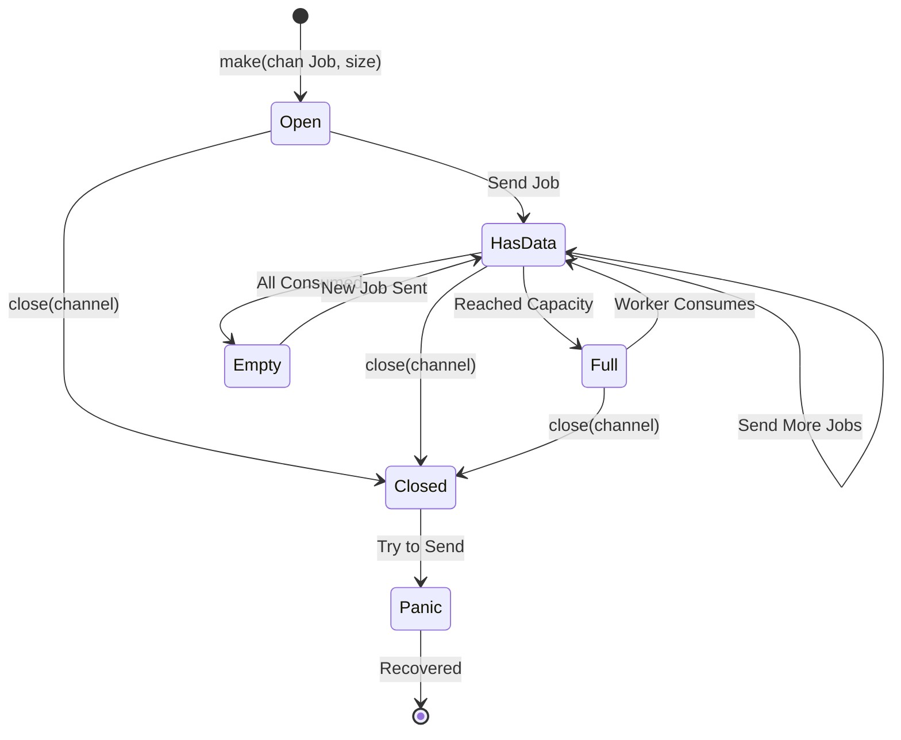

---

## 📝 Naming Conventions

### Package Naming
- **Lowercase**: `server`, `worker`, `ratelimiter`
- **Single word**: Clear, concise
- **No underscores**: Go convention

### Function Naming

#### Constructor Functions
- **NewXxx**: `NewServer()`, `NewWorkerPool()`
- **Purpose**: Creates and initializes new instance
- **Returns**: Pointer to type

#### Factory Functions
- **createXxx**: `createListener()`, `createWorkerPool()`
- **Purpose**: Creates component (lowercase = package-private)
- **Returns**: Component or error

#### Handler Functions
- **handleXxx**: `handleRequests()`
- **Purpose**: Handles/manages a process
- **Usually blocks**: Runs main loop

#### Method Naming
- **Verb + Noun**: `Start()`, `Close()`, `SubmitJob()`
- **Clear action**: What it does is obvious

### Variable Naming

#### Counters
- **connCount**: Connection counter (atomic)
- **connID**: Individual connection ID
- **workerId**: Worker identifier

#### Channels
- **JobChan**: Job channel (suffix "Chan" for clarity)
- **Buffered**: Always specify if buffered

#### Struct Fields
- **PascalCase**: `MaxWorkers`, `QueueSize`, `JobChan`
- **Exported**: Can be accessed outside package
- **Clear purpose**: Name describes what it is

### Type Naming

#### Structs
- **PascalCase**: `Server`, `WorkerPool`, `Job`
- **Singular**: `Job` not `Jobs`
- **Descriptive**: Name describes purpose

#### Interfaces
- **PascalCase**: Usually end with "er" if behavior
- **Example**: `Reader`, `Writer` (not used here, but convention)

### Constants
- **Uppercase**: `MAX_WORKERS` (if exported)
- **Lowercase**: `maxWorkers` (if package-private)

### Error Handling
- **err**: Standard error variable name
- **Return error last**: `(result, error)`

---

## 🎨 Design Patterns Used

### 1. Worker Pool Pattern
- **Fixed workers**: Prevents resource exhaustion
- **Job queue**: Buffers work
- **Concurrent processing**: Multiple workers

### 2. Token Bucket Rate Limiting
- **Token refill**: Gradual rate increase
- **Burst capacity**: MaxTokens allows bursts
- **Thread-safe**: Mutex protection

### 3. Non-blocking Operations
- **Select with default**: Prevents blocking
- **Graceful degradation**: Reject when full

### 4. Graceful Shutdown
- **Channel closing**: Signals workers
- **WaitGroup**: Waits for completion
- **Panic recovery**: Handles edge cases

---

## 🔄 Complete Request Lifecycle

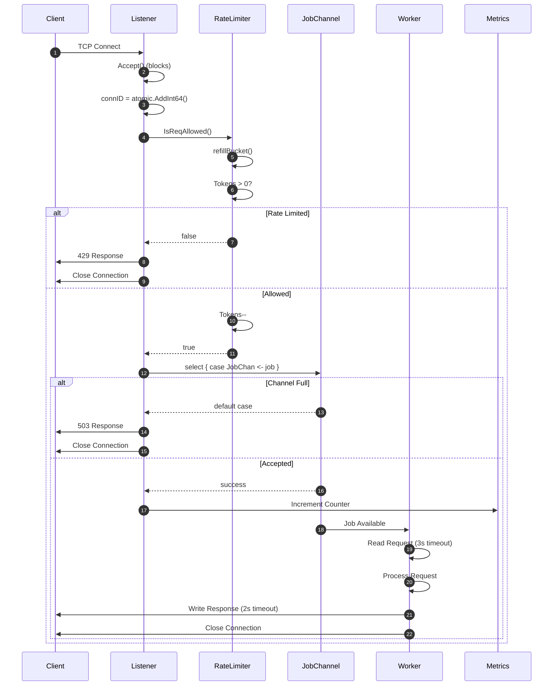

---

## 🚀 Performance Characteristics

### Concurrency Model
- **Accept Loop**: Single goroutine (bottleneck is network I/O)
- **Workers**: N goroutines (configurable)
- **Total Goroutines**: 1 (accept) + N (workers) + 1 (metrics)

### Channel Capacity
- **Formula**: `MaxWorkers + QueueSize`
- **Example**: 2 workers + 5 queue = 7 total capacity
- **Behavior**: Rejects after 7 jobs in system

### Rate Limiting
- **Token Refill**: Continuous (not discrete)
- **Burst**: Allows up to MaxTokens requests immediately
- **Sustained**: Limited to Rate requests/second

---

## 🛡️ Error Handling

### Connection Errors
- **Accept Error**: Fatal (server can't continue)
- **Read Timeout**: Send 408, close connection
- **Write Error**: Close connection silently

### Channel Errors
- **Closed Channel**: Recover panic, send 503
- **Full Channel**: Send 503, close connection

### Rate Limiting
- **No Tokens**: Send 429, close connection
- **Not Configured**: Skip check (MaxTokens == 0)

---

## 📈 Metrics Integration

### Prometheus Metrics
- **Counter**: `Requests.WithLabelValues("processed")`
- **Incremented**: Only when job accepted
- **Exported**: Via HTTP endpoint

### Metric Points
1. **Job Accepted**: After successful channel send
2. **Not Tracked**: Rate-limited, queue-full, errors

---

## 🎯 Key Takeaways

1. **Worker Pool**: Limits concurrency, prevents overload
2. **Non-blocking**: Accept loop never blocks
3. **Rate Limiting**: Token bucket with continuous refill
4. **Graceful Shutdown**: Channel closing + WaitGroup
5. **Error Handling**: Timeouts, panic recovery, proper HTTP responses
6. **Channel Size**: `MaxWorkers + QueueSize` for correct capacity
7. **Atomic Operations**: Thread-safe counters
8. **Pure Functions**: Standalone functions for testability

---

## 🔧 Configuration

### Server Options
```go
ServerOpts {
    MaxThreads: 2,    // Number of worker goroutines
    QueueSize:  5,    // Jobs that can wait
    Rate:       2,    // Tokens per second
    Tokens:     5,    // Maximum tokens (burst capacity)
}
```

### Capacity Calculation
- **Total Capacity**: 2 workers + 5 queue = 7 jobs
- **Rate Limit**: 5 tokens (burst) + 2/sec (sustained)
- **Rejection**: After 7 jobs OR no tokens

---

This architecture provides a robust, scalable TCP server with proper concurrency control, rate limiting, and graceful error handling.

