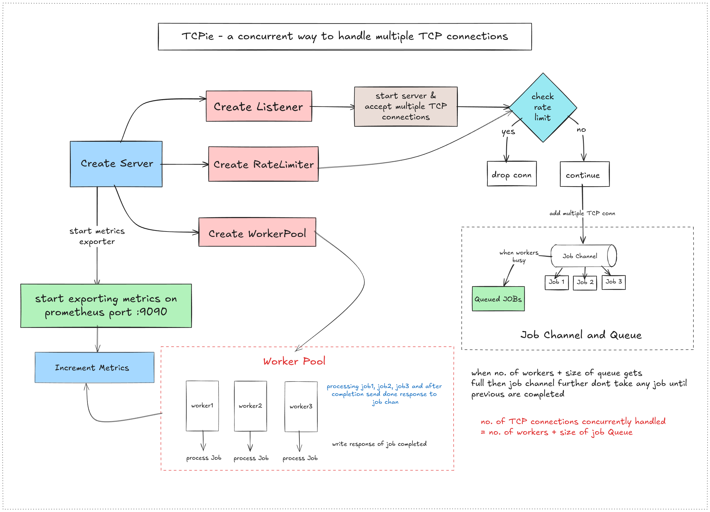

# TCPie

> **a basic TCP server that handles multiple concurrent connections**



High-performant TCP server built from scratch in Go that handles concurrent connections using a worker pool pattern with buffered channels. The server accepts TCP connections, applies token bucket rate limiting to control request throughput, and distributes incoming jobs to a pool of worker goroutines for parallel processing. Each worker reads HTTP requests, processes them, and sends responses back through the connection before closing it. 
Prometheus metrics are exposed on a separate HTTP endpoint to monitor request counts, rate limiting events, and server performance in real-time.

Made this tiny side project just to play with worker pool pattern of concurrency model with TCP !!
If you like this pls give a star to repo.

## Project Structure

```
tcpie/
├── cmd/
│   └── main.go              # Application entry point
├── internals/
│   ├── config/
│   │   ├── config.go        # Config structs
│   │   └── config.yaml      # Configuration file
│   ├── metrics/
│   │   └── metrics.go       # Prometheus metrics
│   ├── rate-limiter/
│   │   └── rate-limiter.go  # Token bucket rate limiter
│   ├── server.go            # TCP server implementation
│   └── worker.go            # Worker pool implementation
└── README.md               # This file
```

## Testing the Server

1. **Start the server:**
   ```bash
   go run cmd/main.go
   ```

2. **In another terminal, test with curl:**
   ```bash
   curl http://localhost:8080
   ```
   Expected response: `HTTP/1.1 200 OK\r\n\r\n Hello world ! \r\n`

3. **Check metrics:**
   ```bash
   curl http://localhost:9090/metrics | grep total_requests
   ```

4. **Test rate limiting:**
   ```bash
   # Send multiple rapid requests
   for i in {1..20}; do curl http://localhost:8080 & done
   ```
