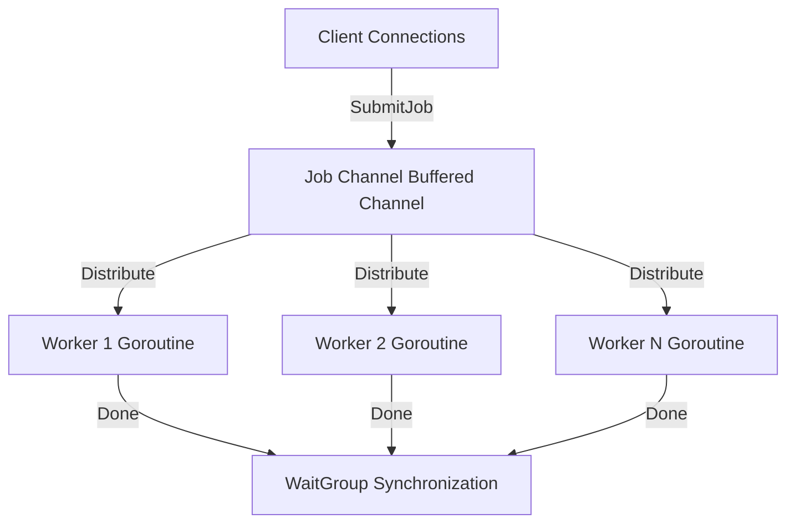
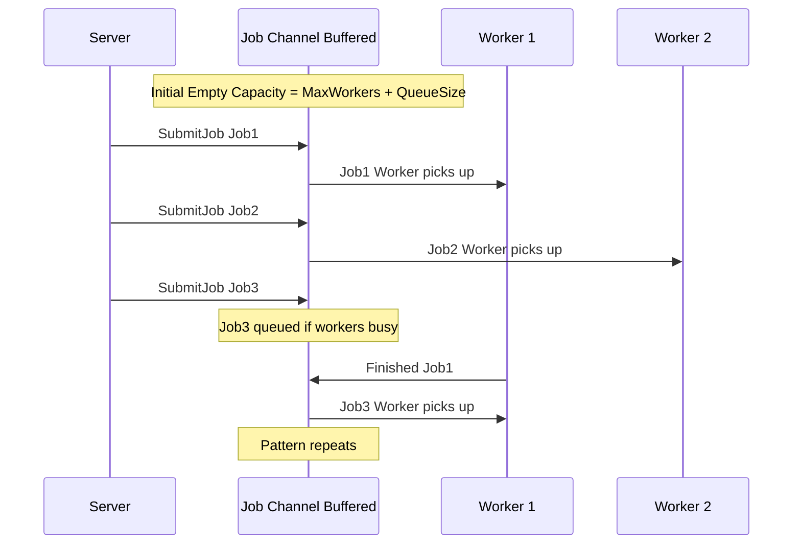
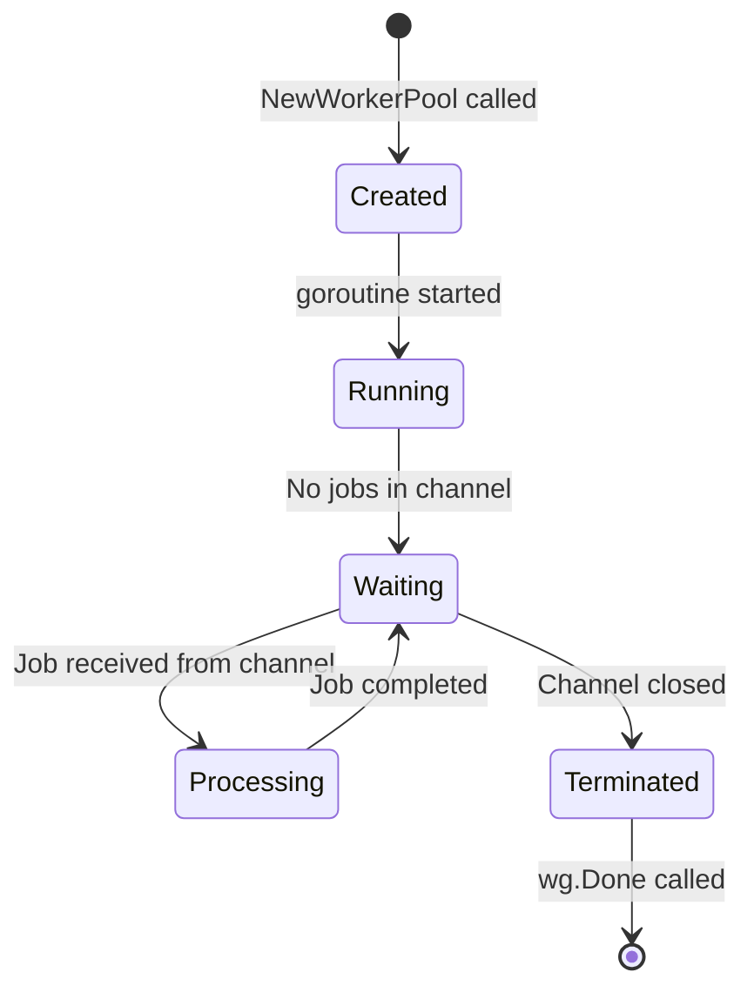
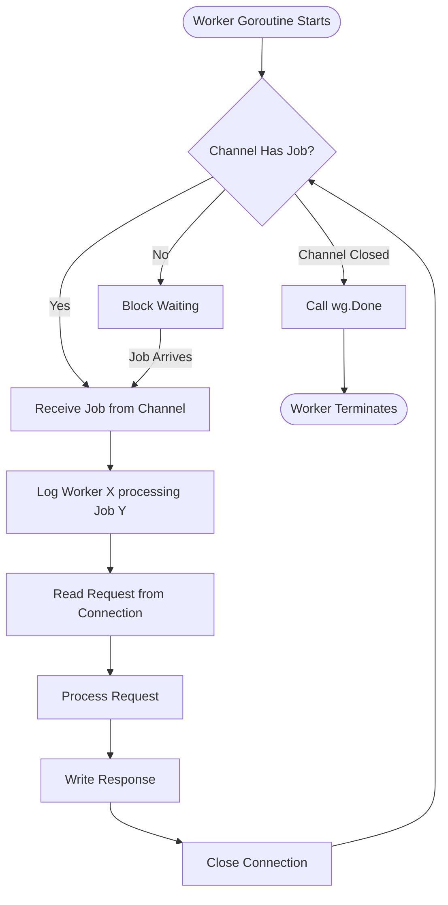
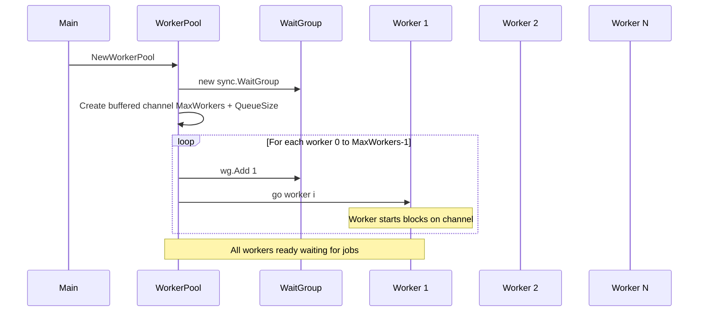
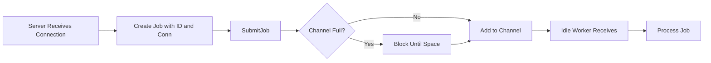
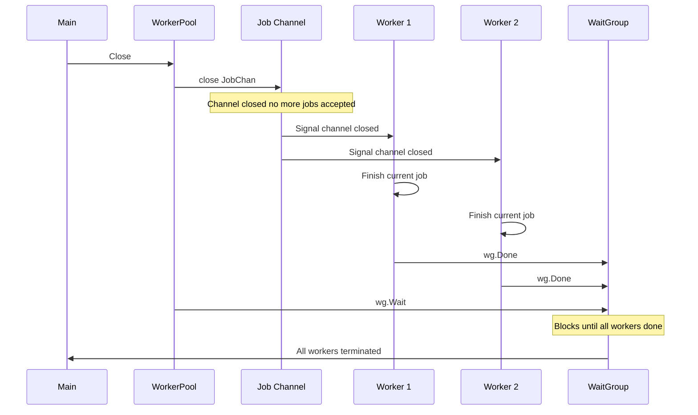
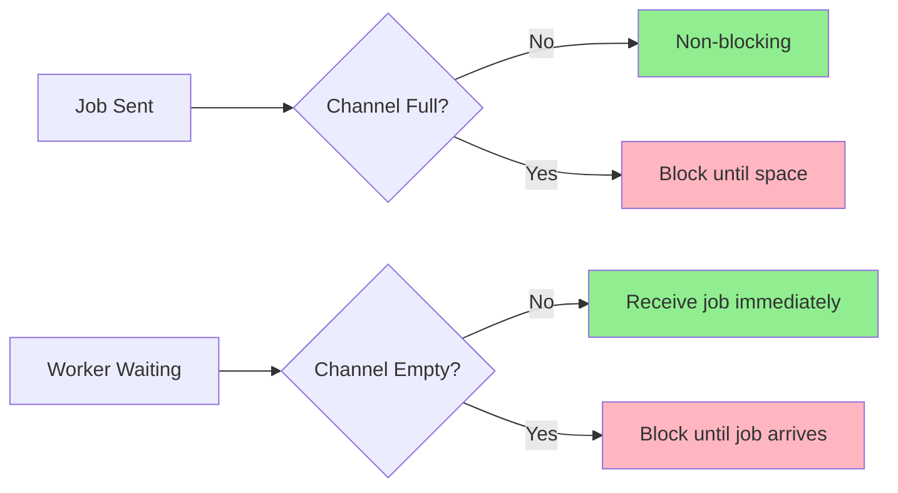
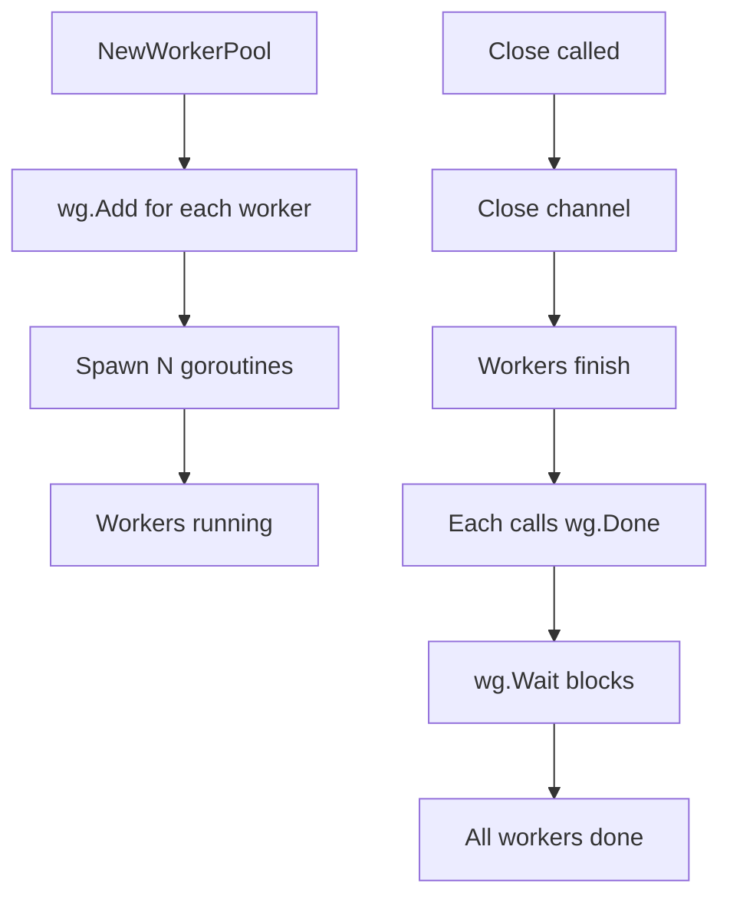

# Worker Pool Architecture Explanation

> **Note**: This document contains Mermaid diagrams. For best viewing:
> - GitHub/GitLab: Diagrams render automatically
> - VS Code: Install "Markdown Preview Mermaid Support" extension
> - Other viewers: May need Mermaid.js support enabled

## Overview

This file implements a **worker pool pattern** using Go's concurrency primitives (goroutines and channels) to handle multiple network connections concurrently. It's designed to process HTTP-like requests efficiently by distributing work across a pool of worker goroutines.

---

## Core Components

### 1. **Job Structure**
```go
type Job struct {
    Id   int
    Conn net.Conn
}
```
- Represents a single task/request
- Contains a unique ID and a network connection to process

### 2. **WorkerPool Structure**
```go
type WorkerPool struct {
    MaxWorkers int      // Maximum concurrent workers
    QueueSize  int      // Buffer size for queued jobs
    JobChan    chan Job // Buffered channel for job distribution
    wg         *sync.WaitGroup // Synchronization primitive
}
```

---

## Architecture Diagram



---

## Concurrency Model: Channels

### How Channels Work Here

**Buffered Channel:**
```go
JobChan = make(chan Job, w.MaxWorkers + w.QueueSize)
```

- **Type**: Buffered channel (can hold `MaxWorkers + QueueSize` jobs)
- **Purpose**: Acts as a **job queue** and **synchronization mechanism**
- **Behavior**:
  - If channel has space → job is added immediately (non-blocking)
  - If channel is full → `SubmitJob` blocks until a worker takes a job
  - Workers block on `range w.JobChan` until a job arrives

### Channel Flow Diagram



---

## Worker Function Deep Dive

### Code Structure
```go
func (w *WorkerPool) worker(workerId int) {
    processRequests := func(j Job) {
        // Read request from connection
        request := make([]byte, 1024)
        j.Conn.Read(request)
        
        // Send response
        response := []byte("HTTP/1.1 200 OK\r\n\r\n Hello world ! \r\n")
        j.Conn.Write(response)
        j.Conn.Close()
    }

    // Main worker loop
    for job := range w.JobChan {
        log.Printf("Worker %d, processing request %d", workerId, job.Id)
        processRequests(job)
    }

    w.wg.Done()
}
```

### Worker Lifecycle



### Worker Execution Flow



---

## Worker Pool Lifecycle

### Initialization Phase



### Job Submission Flow



### Shutdown Phase



---

## Concurrency Patterns Used

### 1. **Producer-Consumer Pattern**
- **Producer**: `SubmitJob()` adds jobs to channel
- **Consumers**: Worker goroutines consume jobs from channel
- **Synchronization**: Channel handles coordination automatically

### 2. **Worker Pool Pattern**
- Fixed number of workers (controlled concurrency)
- Prevents resource exhaustion
- Better than spawning unlimited goroutines

### 3. **Graceful Shutdown**
- `WaitGroup` ensures all workers finish before shutdown
- Channel closure signals workers to stop
- No jobs are lost during shutdown

---

## Key Concurrency Concepts

### Channel Blocking Behavior



### WaitGroup Synchronization



---

## Example Execution Timeline

```mermaid
gantt
    title Worker Pool Execution Timeline
    dateFormat X
    axisFormat %s
    
    section Worker 1
    Waiting           :0, 2
    Processing Job 1  :2, 3
    Waiting           :5, 1
    Processing Job 3  :6, 3
    
    section Worker 2
    Waiting           :0, 1
    Processing Job 2  :1, 4
    Waiting           :5, 2
    Processing Job 4  :7, 2
    
    section Channel
    Job 1 Queued      :0, 1
    Job 2 Queued      :1, 1
    Job 3 Queued      :5, 1
    Job 4 Queued      :6, 1
```



---

## Benefits of This Design

1. **Controlled Concurrency**: Limits simultaneous connections to `MaxWorkers`
2. **Backpressure**: Queue size limits prevent unbounded memory growth
3. **Efficient Resource Usage**: Reuses goroutines instead of creating new ones per request
4. **Graceful Shutdown**: Ensures all work completes before termination
5. **Load Distribution**: Channel automatically distributes work to available workers

---

## Potential Improvements

1. **Error Handling**: `Conn.Read()` and `Conn.Write()` errors are ignored
2. **Context Support**: Could add context for cancellation
3. **Metrics**: Could track job processing times, queue depth
4. **Timeout Handling**: No timeout for reading/writing connections

